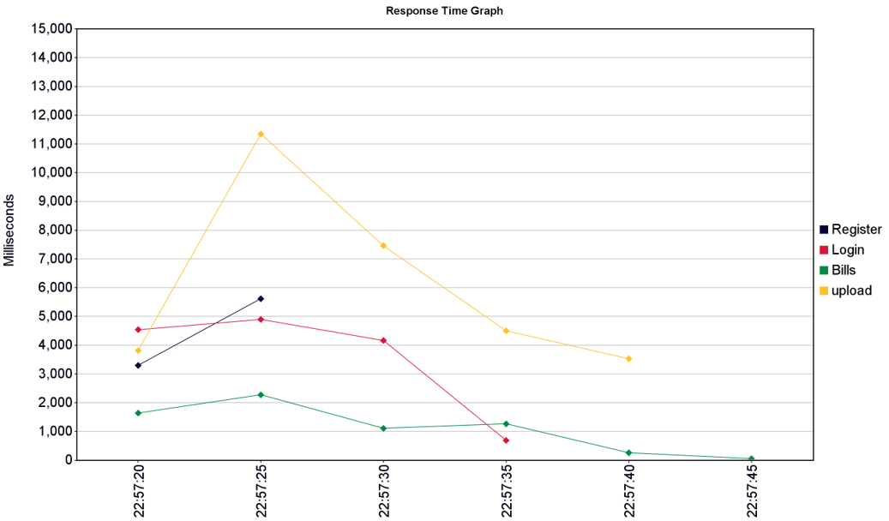
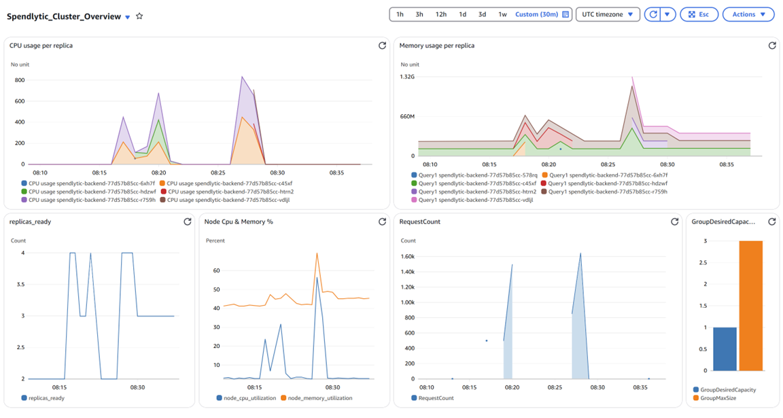

# Spendlytic

Spendlytic is a smart, data-driven expense tracking application with a modern web frontend and a robust backend powered by AI and cloud technologies. It enables users to upload receipts, automatically extract and categorize expenses, and visualize their spending patterns with insightful analytics.

## Project Structure

- **backend/**: Flask-based REST API, PostgreSQL, OpenAI GPT-4 integration, AWS support, Dockerized, and Kubernetes-ready. See [backend/README.md](backend/README.md).
- **frontend-ts/**: TypeScript-based modern frontend (React + TS). See [frontend-ts/README.md](frontend-ts/README.md).
- **docs/**: Documentation, experiment results, and project reports.

## Features
- User authentication and JWT-based security
- Receipt/bill upload and AI-powered extraction
- Expense dashboard and analytics
- Secure, cloud-ready, and containerized
- Modern, responsive UI
- Detailed analytics and visualizations

## Experiments & Performance Evaluation

To ensure Spendlytic delivers a fast and reliable user experience, we conducted a series of experiments measuring system latency and accuracy of AI-powered extraction. The experiments included:

- **End-to-end latency measurement** for bill upload, extraction, and dashboard update.
- **Scalability tests** under concurrent user load.
- **Accuracy evaluation** of AI-based receipt parsing.

### Latency Results

The following graph shows the system latency observed during various stages of the workflow:

### Extraction & Analytics Results

The results below summarize the accuracy and effectiveness of the AI-powered extraction and analytics modules:

For more details, see the full experiment report in [Docs/Final_ECC_Project.pdf](Docs/Final_ECC_Project.pdf) and the project presentation.

## Quick Start

See the respective README files in `backend/` and `frontend-ts/` for setup and usage instructions.

---

© 2025 Spendlytic. All rights reserved.
